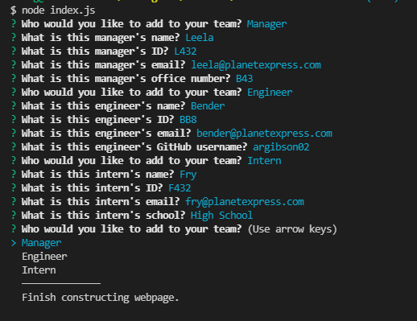
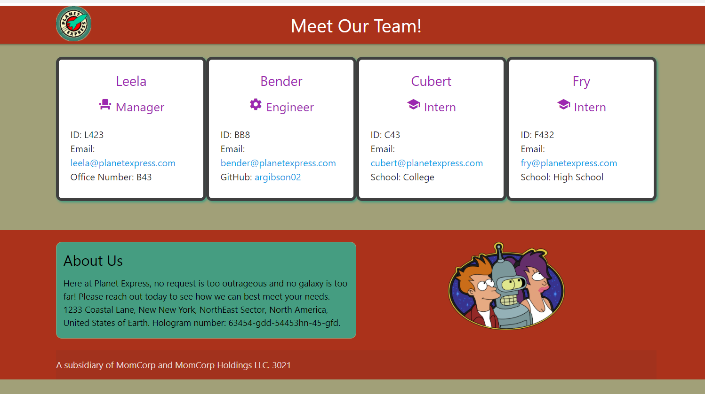

# Team-Profile-Generator
  -----------------

## Table of Contents
  - [Description](#Description)
  - [Installation Instructions and Getting Started](#Installation)
  - [Built With](#Built)
  - [Technologies Used](#Technologies)
  - [Authors](#Authors)
  - [Acknowledgments](#Acknowledgments)

## Description
This is a Futurama-themed team profile generator tool powered Node.js and Inquirer. Users can input their team members info into a command prompt and auto-generate a team webpage!

Features
* Futurama theme!
* Jest driven unit tests in the background.

**[Click this link WATCH the Team-Profile-Generator in action](https://watch.screencastify.com/v/hn5xgCNvNINj69kqOtQo)**

[Click this link to go to demo webpage](https://argibson02.github.io/Team-Profile-Generator/)

  

## Installation Instructions and Getting Started
Node.js, Inquirer, and Jest need to be installed. To start the application, navigate in a command console to the folder that houses index.js and enter in 'node index.js'.

## Built With
* [HTML](https://developer.mozilla.org/en-US/docs/Web/HTML)
* [CSS](https://developer.mozilla.org/en-US/docs/Web/CSS)
* [JavaScript](https://developer.mozilla.org/en-US/docs/Web/JavaScript)
* [jQuery](https://api.jquery.com/)
* [Node.js](https://nodejs.org/en/)
* [Jest](https://jestjs.io/) 
* [Inquirer](https://www.npmjs.com/package/inquirer) 
* [Materialize](https://materializecss.com/)

## Technologies Used
* [Microsoft Visual Studio Code](https://code.visualstudio.com/)
* [Git Bash](https://git-scm.com/downloads)
* [GitHub](https://github.com/)

## Practices Used
* Agile style User Story and Acceptance Criteria.

## Authors
**Alexander Gibson** 

- [Link to Alex's Portfolio Site](https://argibson02.github.io/Team-Profile-Generator/)
- [Link to Alex's Github](https://github.com/argibson02)
- [Link to Alex's LinkedIn](www.linkedin.com/in/alexander-gibson-1b0bb6105)

## Acknowledgments 😊
- Thanks to Jerome, Manuel, Cheng, and Daniel for instructing the UCB Coding Bootcamp.

